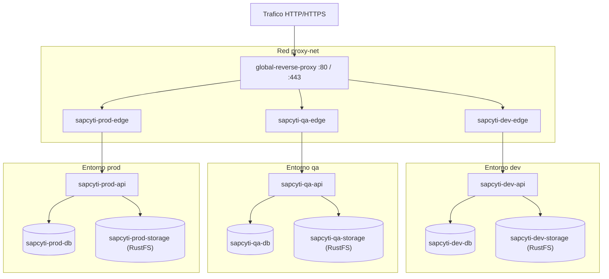

# Arquitectura del Servidor

Topologia y modelo de red en el servidor `servidopcyti`.

## 1. Topologia general

El servidor ejecuta entornos independientes (`dev`, `qa`, `prod`) sobre Docker Compose bajo el usuario `deployment`.



## 2. Redes Docker

- `proxy-net`: Red externa compartida. Conecta `global-reverse-proxy` con el contenedor `edge` de cada entorno.
- `internal-net`: Red privada dentro de cada Compose. Comunica `db`, `api`, `storage` (RustFS S3) y `edge`. La base de datos y el almacenamiento de objetos nunca se exponen fuera de esta red (ver [document-storage.md](document-storage.md)).

## 3. Matriz de entornos

| Entorno | Dominio publico | Rama Git | Tag GHCR | Perfil Spring | Puerto loopback host |
|---|---|---|---|---|---|
| dev | `https://dev.sapcyti.site` | `develop` | `dev` | `docker` | `127.0.0.1:8090` |
| qa | `https://qa.sapcyti.site` | `release/*` | `qa` | `qa` | `127.0.0.1:9090` |
| prod | `https://sapcyti.site` | `main` | `prod` | `prod` | `127.0.0.1:8080` |

Los puertos loopback se usan unicamente para diagnostico local en el servidor (`curl localhost:<puerto>`).

## 4. Filesystem en el servidor (`deployment@servidopcyti`)

```text
/home/deployment/
- nginx-proxy/
  - certs/          # Certificados SSL (.crt, .key)
  - conf.d/         # reverse_proxy.conf
  - docker-compose.yml
- sapcyti/
  - dev/            # docker-compose.yml, env_build.sh, .env
  - qa/
  - prod/
```
