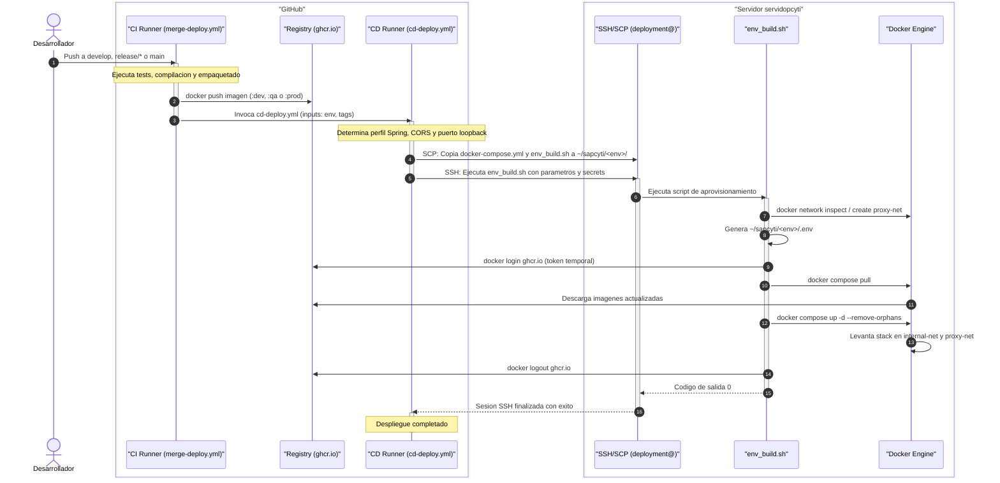

# Pipeline de CI/CD

Flujo automatizado de despliegue coordinado entre los repositorios de aplicacion y `sapcyti-infra`.

## 1. Diagrama de secuencia del despliegue



## 2. Invocacion desde repositorios de aplicacion

En `sapcyti-api` y `sapcyti-spa`, el workflow `merge-deploy.yml` invoca el motor central al terminar la construccion:

```yaml
uses: SAPCyTI-UAM-I/sapcyti-infra/.github/workflows/cd-deploy.yml@main
with:
  environment: ${{ needs.ci-build.outputs.env_name }}
  api_image: ghcr.io/${{ needs.ci-build.outputs.image_owner }}/sapcyti-api:${{ needs.ci-build.outputs.image_tag }}
  spa_image: ghcr.io/${{ needs.ci-build.outputs.image_owner }}/sapcyti-spa:${{ needs.ci-build.outputs.image_tag }}
secrets: inherit
```

## 3. Fases del motor `cd-deploy.yml`

1. **Resolucion de parametros**:
   - `dev`: perfil `docker`, CORS `https://dev.sapcyti.site`, puerto loopback `8090`.
   - `qa`: perfil `qa`, CORS `https://qa.sapcyti.site`, puerto loopback `9090`.
   - `prod`: perfil `prod`, CORS `https://prod.sapcyti.site`, puerto loopback `8080`.
2. **Transferencia SCP (`appleboy/scp-action`)**:
   - Copia `production/docker-compose.yml` y `production/env_build.sh` hacia `~/sapcyti/<env>/`.
3. **Ejecucion SSH (`appleboy/ssh-action`)**:
   - Ejecuta `~/sapcyti/<env>/env_build.sh` pasando variables de base de datos, token GHCR y configuraciones de red.

## 4. Acciones de `env_build.sh` en el servidor

El script ejecuta en el servidor:
1. Verifica que la red compartida `proxy-net` exista; si no, la crea.
2. Escribe el archivo `.env` del entorno con las variables requeridas por Docker Compose.
3. Inicia sesion temporal en GHCR (`docker login`).
4. Descarga imagenes y recrea contenedores (`docker compose pull && docker compose up -d --remove-orphans`).
5. Cierra sesion en GHCR (`docker logout`).

## 5. Secretos requeridos

| Secreto | Uso |
|---|---|
| `SSH_HOST` | Host o IP del servidor. |
| `SSH_USER` | Usuario de despliegue (`deployment`). |
| `SSH_KEY` | Clave privada SSH. |
| `POSTGRES_PASSWORD` | Password de la base de datos del entorno. |
| `GHCR_PAT` | Token de GitHub con permiso `read:packages`. |
| `RESEND_API_KEY` | API key para envio de correos (opcional). |
| `JWT_PRIVATE_KEY` | Clave privada para firma de tokens JWT (opcional). |
| `JWT_PUBLIC_KEY` | Clave publica para validacion de tokens JWT (opcional). |
