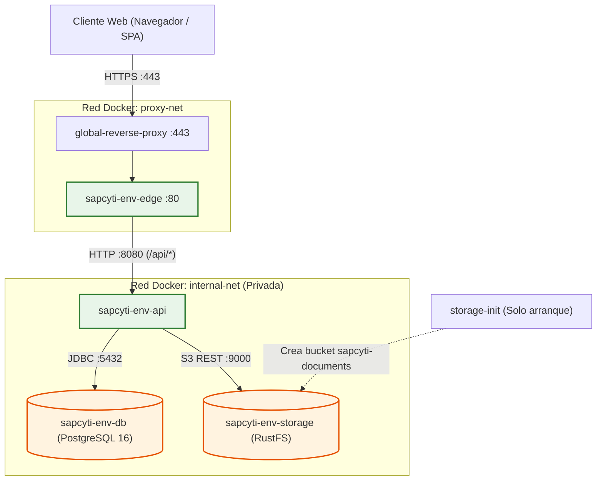
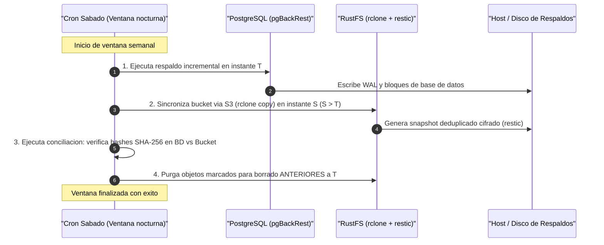

# Almacenamiento de Documentos y Configuracion de Buckets (S3 / RustFS)

Especificacion de infraestructura, topologia, configuracion de buckets y politicas de acceso para el almacenamiento de objetos de solicitudes de examen de posgrado (HU-62 a HU-74).

---

## 1. Proposito y Contexto

El modulo de solicitudes de examen de posgrado de SAPCyTI requiere almacenar de manera confiable, privada y durable documentos probatorios y de grado en formato PDF (tesis, historial academico, constancia de idioma, solicitud de sinodales, datos del alumno y articulos publicados).

### Decision de motor: RustFS (S3-Compatible)
- **Servicio on-premise:** Ejecutado como contenedor de servicio en el servidor universitario `servidopcyti`.
- **Compatibilidad Amazon S3:** Implementa la API REST estandar de AWS S3 (Bucket API y Object API), permitiendo el uso de clientes estandar (AWS SDK v2 en Java, MinIO Client `mc`, `rclone`, `restic`).
- **Rendimiento y seguridad de memoria:** Desarrollado en Rust, con bajo consumo de CPU/RAM y licencia permisiva Apache 2.0 (evitando restricciones de licencias copyleft como AGPL).
- **Aislamiento documental:** El sistema almacena archivos de cualquier tamano sin imponer bloqueos artificiales por peso en el almacenamiento (la cota de 20 MB es una restriccion tecnica exclusiva del proveedor de correo electronico para envios y adjuntos externos).

---

## 2. Topologia de Red y Aislamiento

El almacenamiento de objetos opera bajo el principio de **cero exposicion publica directa**. El bucket nunca se expone a Internet ni a la red de proxy inverso.



### Reglas de red:
1. **Red interna exclusiva (`internal-net`):** El contenedor `storage` pertenece exclusivamente a `internal-net`. No esta conectado a `proxy-net`.
2. **Sin puertos publicados en produccion:** En entornos desplegados (`dev`, `qa`, `prod`), los puertos 9000 (API S3) y 9001 (Consola) **no se mapean al host**.
3. **Acceso mediado por la API:** Toda lectura, subida, descarga individual (HU-66, HU-71) y empaquetado ZIP (HU-69, HU-71) pasa obligatoriamente por el backend Spring Boot (`sapcyti-api`), el cual valida JWT, contexto de tenant o tokens de acceso opacos (HU-68/69).

---

## 3. Especificacion del Bucket y Claves de Objeto

### 3.1 Bucket unico privado
- **Nombre canonico:** `sapcyti-documents`
- **Visibilidad:** Estrictamente privado (`private`). Todo acceso anonimo o no autenticado devuelve `403 AccessDenied`.
- **Cifrado en reposo:** Cifrado activado en el volumen de almacenamiento subyacente.

### 3.2 Esquema de Claves (Object Keys)
Las rutas dentro del bucket siguen una estructura jerarquica e inmutable basada en identificadores unicos numericos:

```text
{posgradoId}/{alumnoId}/exam-requests/{solicitudId}/{documentoId}.pdf
```

**Ejemplo:**
```text
sapcyti-documents/1/450/exam-requests/108/5021.pdf
```

### 3.3 Principios de Diseno:
- **Nombres originales como metadatos en BD:** El nombre de archivo proporcionado por el alumno (`Tesis_Mtria_Lopez_Alba_Emanuel.pdf`) se almacena en la tabla `exam_request_documents` de PostgreSQL y se envia en la cabecera `Content-Disposition` durante la descarga. No se incluye en la clave S3 para evitar problemas de codificacion, caracteres especiales, colisiones entre homonimos o exposicion de datos personales en logs del bucket.
- **Sin sobrescritura en caliente:** Cada carga genera un nuevo `documentoId` y una clave de objeto unica. Al reemplazar un archivo en HU-70, primero se sube el nuevo objeto a RustFS, luego se actualiza la referencia en la base de datos y el objeto anterior se marca para borrado diferido tras el respaldo semanal.
- **Articulos como enlace externo:** Si el alumno registra un articulo mediante URL HTTPS (permitido en doctorado), este se guarda en la columna `external_url` de la base de datos y **no genera ningun objeto en el bucket**.

---

## 4. Politicas de Acceso y Mínimo Privilegio

Se configuran dos identidades tecnicas independientes con politicas de minimo privilegio:

### 4.1 Identidad de la Aplicacion (`sapcyti-api`)
Es la credencial utilizada por el backend Spring Boot. Tiene acceso exclusivo al bucket `sapcyti-documents` para lectura, escritura y multipart, sin privilegios administrativos.

```json
{
  "Version": "2012-10-17",
  "Statement": [
    {
      "Sid": "AllowBucketListing",
      "Effect": "Allow",
      "Action": [
        "s3:ListBucket",
        "s3:GetBucketLocation"
      ],
      "Resource": "arn:aws:s3:::sapcyti-documents"
    },
    {
      "Sid": "AllowDocumentOperations",
      "Effect": "Allow",
      "Action": [
        "s3:GetObject",
        "s3:PutObject",
        "s3:AbortMultipartUpload"
      ],
      "Resource": "arn:aws:s3:::sapcyti-documents/*"
    }
  ]
}
```

### 4.2 Identidad de Respaldo (`sapcyti-backup`)
Utilizada exclusivamente por la tarea de sincronizacion semanal (`rclone`). Es de solo lectura estricta:

```json
{
  "Version": "2012-10-17",
  "Statement": [
    {
      "Sid": "AllowBackupRead",
      "Effect": "Allow",
      "Action": [
        "s3:ListBucket",
        "s3:GetObject"
      ],
      "Resource": [
        "arn:aws:s3:::sapcyti-documents",
        "arn:aws:s3:::sapcyti-documents/*"
      ]
    }
  ]
}
```

---

## 5. Streaming y Desempeno de Archivos

Para cumplir con el requerimiento de soportar archivos de cualquier volumen sin bloqueos artificiales por peso:

1. **Subida por Streaming / Spool:**
   - La API recibe las peticiones `multipart/form-data` y transfiere los bytes hacia RustFS mediante streaming directo o un archivo de spool temporal en disco, evitando acumular el payload completo en la memoria heap de la JVM.
2. **Descarga y Visor PDF (HU-66, HU-71):**
   - El endpoint de descarga obtiene el InputStream desde RustFS y lo envia al cliente mediante `StreamingResponseBody`, con cabecera `Content-Type: application/pdf` y `Content-Disposition: inline` o `attachment`.
3. **Descarga en ZIP (HU-69, HU-71):**
   - El archivo ZIP con los documentos del tramite se genera al vuelo mediante streaming (`ZipOutputStream`), transfiriendo cada objeto directamente desde RustFS al flujo HTTP sin crear archivos ZIP gigantes temporales en disco.
4. **Configuracion de Nginx Edge:**
   - Las directivas de Nginx en `sapcyti-spa/docker/nginx/default.conf.template` se configuran para soportar transferencias de archivos grandes sin interrupcion por timeout o desbordamiento de socket (`proxy_read_timeout 300s`, `proxy_request_buffering off` si se requiere streaming directo).

---

## 6. Configuracion para el Servidor (Produccion / QA / Dev)

### 6.1 Definicion del Servicio en `production/docker-compose.yml`

```yaml
services:
  # ... servicios db y api ...

  storage:
    image: ${STORAGE_IMAGE:-rustfs/rustfs:latest}
    container_name: sapcyti-${ENV_NAME}-storage
    restart: unless-stopped
    environment:
      RUSTFS_ACCESS_KEY: ${STORAGE_ACCESS_KEY}
      RUSTFS_SECRET_KEY: ${STORAGE_SECRET_KEY}
      MINIO_ROOT_USER: ${STORAGE_ACCESS_KEY}
      MINIO_ROOT_PASSWORD: ${STORAGE_SECRET_KEY}
    volumes:
      - storage-data:/data
    networks:
      - internal-net
    healthcheck:
      test: ["CMD-SHELL", "curl -sf http://localhost:9000/health || curl -sf http://localhost:9000/ || exit 1"]
      interval: 10s
      timeout: 5s
      retries: 5

  storage-init:
    image: minio/mc:latest
    container_name: sapcyti-${ENV_NAME}-storage-init
    restart: "no"
    depends_on:
      storage:
        condition: service_healthy
    networks:
      - internal-net
    entrypoint: >
      /bin/sh -c "
      /usr/bin/mc alias set rustfs http://storage:9000 $${STORAGE_ACCESS_KEY} $${STORAGE_SECRET_KEY} --api s3v4;
      /usr/bin/mc mb --ignore-existing rustfs/sapcyti-documents;
      exit 0;
      "

volumes:
  db-data:
    name: sapcyti-${ENV_NAME}-db-data
  storage-data:
    name: sapcyti-${ENV_NAME}-storage-data
```

### 6.2 Variables de Entorno en `production/env_build.sh`

El script de construccion de entorno inyecta en el archivo `.env` de cada entorno las variables requeridas por Spring Boot:

| Variable | Descripcion | Valor / Formato |
|---|---|---|
| `STORAGE_IMAGE` | Imagen Docker fijada | `rustfs/rustfs:latest` (o tag fijado) |
| `STORAGE_ACCESS_KEY` | Clave de acceso administrativa | Generada aleatoriamente o provista por secreto |
| `STORAGE_SECRET_KEY` | Clave secreta administrativa | Minimo 32 caracteres seguros |
| `STORAGE_S3_ENDPOINT` | URL interna del servicio | `http://storage:9000` |
| `STORAGE_S3_REGION` | Region S3 (requerida por SDK) | `us-east-1` |
| `STORAGE_S3_BUCKET` | Nombre del bucket | `sapcyti-documents` |
| `STORAGE_S3_PATH_STYLE_ACCESS` | Acceso tipo path (no virtual host) | `true` |

---

## 7. Configuracion para Desarrollo Local (`local-dev`)

Para permitir que los desarrolladores prueben la integracion de documentos en su entorno local sin depender de servicios externos, se proporcionan dos modalidades:

### 7.1 Modalidad 1: Solo Storage (`local-dev/docker-compose.storage.yml`)
Permite levantar unicamente el servicio de almacenamiento con la consola de administracion expuesta para inspeccionar visualmente los archivos subidos durante pruebas manuales:

```bash
docker compose -f local-dev/docker-compose.storage.yml up -d
```

- **Endpoint API S3:** `http://localhost:9000`
- **Consola Web RustFS/MinIO:** `http://localhost:9001`
- **Credenciales por defecto:** `sapcyti_dev_access` / `sapcyti_dev_secret_key`
- **Bucket auto-creado:** `sapcyti-documents`

### 7.2 Modalidad 2: Stack Completo Integrado (`local-dev/docker-compose.stack.yml`)
Integra `db`, `storage`, `api` y `edge`:

```bash
docker compose -f local-dev/docker-compose.stack.yml up -d --build
```

El servicio `api` depende de la salud de `db` y `storage`, y consume las variables definidas en `local-dev/.env`.

---

## 8. Estrategia de Respaldos Pareados y Recuperacion ante Desastres

Conforme a la especificacion de arquitectura (Architecture §7.1 y `Docs/design/notes/almacenamiento-documentos.md`):



### 8.1 Principio de Paridad Temporal (T / S)
1. **Instante T (Base de datos):** `pgBackRest` realiza el respaldo de PostgreSQL.
2. **Instante S (Bucket):** `rclone` y `restic` realizan el snapshot de los objetos de `sapcyti-documents`. Al ejecutarse `S > T`, todo objeto que la base de datos referenciaba en T existe en S.
3. **Purga diferida:** Los objetos marcados para borrado tras actualizaciones en HU-70 **solo se eliminan fisicamente del bucket** si su marca de reemplazo es anterior a T y el respaldo del dia fue validado exitosamente.

### 8.2 Procedimiento de Restauracion en un Host o Bucket Nuevo
1. **Levantar nuevo servicio:** Iniciar un contenedor RustFS vacio y crear el bucket `sapcyti-documents`.
2. **Restaurar objetos:** Ejecutar `restic restore <snapshot_id>` hacia un directorio temporal y cargar al bucket con `rclone copy --s3-provider=Minio /tmp/restore/ rustfs:sapcyti-documents`.
3. **Restaurar base de datos:** Ejecutar `pgbackrest restore` hacia PostgreSQL en el instante T pareado.
4. **Ejecutar conciliacion:** Verificar que todas las filas de `exam_request_documents` encuentren su objeto con el `sha256` identico.
5. **Iniciar API:** Iniciar `sapcyti-api` con las credenciales del nuevo bucket.

---

## 9. Comandos Operativos y Diagnostico

Comandos para el operador del sistema en `servidopcyti`:

```bash
# 1. Verificar estado del contenedor de almacenamiento
docker ps --filter "name=storage"

# 2. Consultar logs de RustFS en un entorno especifico
docker logs -f sapcyti-prod-storage

# 3. Listar contenido del bucket usando el contenedor init o mc
docker exec -it sapcyti-prod-storage-init /usr/bin/mc ls storage/sapcyti-documents/

# 4. Verificar salud del servicio via HTTP interno
docker exec -it sapcyti-prod-api curl -I http://storage:9000/
```
