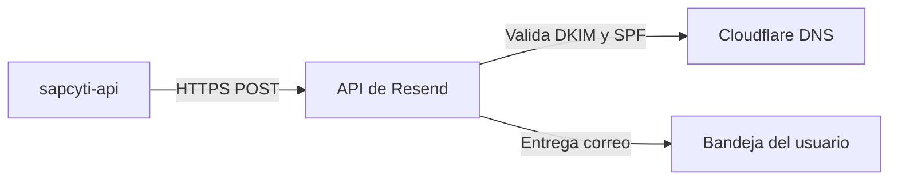

# Servicio de Correo Transaccional (Resend)

Configuracion del servicio de correo para notificaciones y recuperacion de contrasena en SAPCyTI.

## 1. Proveedor y arquitectura

SAPCyTI utiliza **Resend** mediante su API REST (HTTPS directo a `https://api.resend.com/emails`). No se utiliza conexion SMTP en los contenedores.

- Correo oficial del sistema: `soporte@sapcyti.site`
- Adaptador backend: `ResendEmailAdapter` en `sapcyti-api`.
- Activacion: `APP_EMAIL_PROVIDER=resend`.
- Modo de operacion: Solo envio saliente (Enable Sending activo; Enable Receiving inactivo).

## 2. Registros DNS en Cloudflare

Configurados en la zona DNS de Cloudflare en modo DNS Only (nube gris):

| Tipo | Nombre | Contenido / Valor | Proposito | Estado |
|---|---|---|---|---|
| TXT | `resend._domainkey` | `p=MIGf...` (clave publica) | Verificacion de dominio y firma criptografica DKIM | Verified |
| CNAME | `rsend` | `rsend.forge.rmta.net` | Validacion de envio SPF (Return-Path / Mail-From) | Verified |
| CNAME | `send` | `send.forge.rmta.net` | Validacion de envio SPF | Verified |
| TXT | `_dmarc` | `v=DMARC1; p=none;` | Politica DMARC del dominio | Configurado |

## 3. Variables de entorno

| Variable | Valor / Descripcion | Entornos |
|---|---|---|
| `APP_EMAIL_PROVIDER` | `resend` | local, dev, qa, prod |
| `RESEND_API_KEY` | Clave de API de Resend (`re_...`). | local (`.env`), dev/qa/prod (Secret GH Actions) |
| `RESEND_FROM` | `SAPCyTI <soporte@sapcyti.site>` | local, dev, qa, prod |
| `PASSWORD_RESET_BASE_URL` | `http://localhost` (local) o `https://<env>.sapcyti.site` (servidor). | local, dev, qa, prod |

## 4. Inyeccion en despliegue continuo

En GitHub Actions:
1. El secret `RESEND_API_KEY` se define en el repositorio o entorno.
2. El workflow `cd-deploy.yml` lo pasa como variable de entorno al script remoto `env_build.sh`.
3. `env_build.sh` escribe la clave en el archivo `.env` del stack (`~/sapcyti/<env>/.env`).
