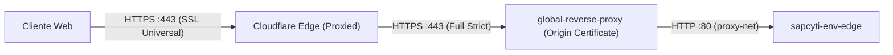

# Reverse Proxy Global y SSL

Configuracion y operacion del proxy Nginx en `/home/deployment/nginx-proxy/` junto con Cloudflare.

## 1. Funcion y arquitectura de red

El proxy inverso global es el unico punto de entrada al host para trafico HTTP y HTTPS.

- Contenedor: `global-reverse-proxy` (imagen `nginx:alpine`).
- Puertos en el host: `80:80` y `443:443`.
- Red: `proxy-net` (externa bridge compartida con los entornos).
- Definicion en repo: `server/nginx-proxy/docker-compose.yml`.

### Cadena de confianza SSL con Cloudflare



1. **Cloudflare DNS**: Registros A para `dev.sapcyti.site`, `qa.sapcyti.site`, `sapcyti.site` y `www.sapcyti.site` apuntan a la IP publica del servidor con el proxy activado (nube naranja).
2. **Modo SSL en Cloudflare**: Configurado en `Full (strict)`. Cloudflare exige y valida un certificado SSL valido en el servidor de origen.
3. **Certificados de origen**: Emitidos como Cloudflare Origin Certificates para `sapcyti.site` y `*.sapcyti.site`.

## 2. Enrutamiento y dominios

Configuracion en `server/nginx-proxy/conf.d/reverse_proxy.conf`:

- **Puerto 80**: Redirige todo el trafico con codigo 301 hacia HTTPS (`https://$host$request_uri`).
- **Puerto 443**: Termina SSL y enruta por Server Name al contenedor correspondiente:

| Dominio | Destino interno (`proxy-net`) |
|---|---|
| `dev.sapcyti.site` | `http://sapcyti-dev-edge:80` |
| `qa.sapcyti.site` | `http://sapcyti-qa-edge:80` |
| `sapcyti.site`, `www.sapcyti.site` | `http://sapcyti-prod-edge:80` |

## 3. Resolucion dinamica de DNS

La configuracion utiliza:

```nginx
resolver 127.0.0.11 valid=10s ipv6=off;
```

Y define la URL en una variable antes del proxy:

```nginx
location / {
    set $edge http://sapcyti-dev-edge:80;
    proxy_pass $edge;
}
```

Esto previene que Nginx falle al arrancar si alguno de los contenedores de los entornos esta temporalmente inactivo.

## 4. Certificados SSL en el servidor

Ubicados en `/home/deployment/nginx-proxy/certs/` del servidor host y montados en modo lectura en `/etc/nginx/certs/:ro`:

```bash
# Listado en el servidor host (/home/deployment/nginx-proxy/certs/):
cloudflare-origin-pull-ca.pem  sapcyti.site.crt  sapcyti.site.key
```

- `sapcyti.site.crt`: Cloudflare Origin Certificate (publico).
- `sapcyti.site.key`: Clave privada del certificado (permisos `600`).
- `cloudflare-origin-pull-ca.pem`: Certificado CA oficial de Cloudflare para validar mTLS en conexiones origin-pull (permisos `644`).

### Descarga del certificado CA de Cloudflare (AOP)

Para instalar o renovar la CA de Authenticated Origin Pulls en el host:

```bash
sudo curl -fsSL -o /home/deployment/nginx-proxy/certs/cloudflare-origin-pull-ca.pem \
  https://developers.cloudflare.com/ssl/static/authenticated_origin_pull_ca.pem

sudo chmod 644 /home/deployment/nginx-proxy/certs/cloudflare-origin-pull-ca.pem
```

> [!NOTE]
> Este archivo es una CA publica proveida por Cloudflare (vigente hasta noviembre de 2029). Todos los certificados en `certs/` estan excluidos en `.gitignore` para prevenir versionado accidental en el repositorio.

## 5. Recarga en caliente

Para aplicar cambios en `reverse_proxy.conf` o renovar certificados sin reiniciar el contenedor:

```bash
docker exec global-reverse-proxy nginx -t
docker exec global-reverse-proxy nginx -s reload
```

## 6. Authenticated Origin Pulls (Origin Lock)

Garantiza que nadie pueda saltarse Cloudflare conectandose directamente a la IP publica del servidor (`148.206.49.238`) en el puerto 443.

### Configuracion en Cloudflare

1. Acceder al dashboard de Cloudflare y seleccionar la zona `sapcyti.site`.
2. Navegar a **SSL/TLS** -> **Origin Server**.
3. En la seccion **Authenticated Origin Pulls**, activar el switch **Global** a **On**.
4. Con esto, los proxies de Cloudflare presentan su certificado cliente TLS en cada conexion hacia el origen.

### Configuracion en Nginx (`reverse_proxy.conf`)

En los bloques de servidor correspondientes (`qa` y `prod`), se exige la validacion del certificado cliente:

```nginx
ssl_client_certificate /etc/nginx/certs/cloudflare-origin-pull-ca.pem;
ssl_verify_client on;
```

### Verificacion del bloqueo de origen

1. **Intento de acceso directo forzado al origen (bypass de Cloudflare):**
   ```bash
   curl -skI --resolve sapcyti.site:443:148.206.49.238 https://sapcyti.site
   ```
   **Resultado esperado y verificado:** `HTTP/1.1 400 Bad Request` (`No required SSL certificate was sent`). Nginx rechaza la conexion porque el cliente no presenta el certificado de Cloudflare.

2. **Acceso legitimo a traves del dominio proxied por Cloudflare:**
   ```bash
   curl -sI https://sapcyti.site
   ```
   **Resultado esperado y verificado:** `HTTP/2 200` o `HTTP/1.1 200 OK`. Cloudflare autentica satisfactoriamente contra Nginx y la peticion transita con normalidad.

## 7. IP Real y Rate Limiting

- **Restauracion de IP**: Nginx lee la cabecera `CF-Connecting-IP` validando que la conexion provenga de los rangos CIDR oficiales de Cloudflare (IPv4 e IPv6).
- **Rate limiting sobre cliente real**: Las directivas `limit_req_zone` usan `$binary_remote_addr`, evaluando la IP autentica del cliente y no la IP del nodo de Cloudflare:
  - `auth_strict_limit`: 5 req/min (burst=3 nodelay) en rutas criticas (`/api/auth/login`, `/forgot-password`, `/reset-password`) en produccion.
  - `api_general_limit`: 30 req/s (burst=20 nodelay) en el resto de la API (`/api/`).
- **QA**: No aplica `auth_strict_limit` para no bloquear suites de pruebas automatizadas.


