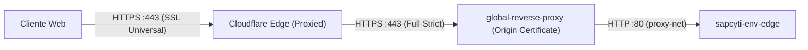

# Reverse Proxy Global y SSL

Configuracion y operacion del proxy Nginx en `/home/deployment/nginx-proxy/` junto con Cloudflare.

## 1. Funcion y arquitectura de red

El proxy inverso global es el unico punto de entrada al host para trafico HTTP y HTTPS.

- Contenedor: `global-reverse-proxy` (imagen `nginx:alpine`).
- Puertos en el host: `80:80` y `443:443`.
- Red: `proxy-net` (externa bridge compartida con los entornos).
- Definicion en repo: `server/nginx-proxy/docker-compose.yml`.

### Cadena de confianza SSL con Cloudflare



1. **Cloudflare DNS**: Registros A para `dev.sapcyti.site`, `qa.sapcyti.site`, `sapcyti.site` y `www.sapcyti.site` apuntan a la IP publica del servidor con el proxy activado (nube naranja).
2. **Modo SSL en Cloudflare**: Configurado en `Full (strict)`. Cloudflare exige y valida un certificado SSL valido en el servidor de origen.
3. **Certificados de origen**: Emitidos como Cloudflare Origin Certificates para `sapcyti.site` y `*.sapcyti.site`.

## 2. Enrutamiento y dominios

Configuracion en `server/nginx-proxy/conf.d/reverse_proxy.conf`:

- **Puerto 80**: Redirige todo el trafico con codigo 301 hacia HTTPS (`https://$host$request_uri`).
- **Puerto 443**: Termina SSL y enruta por Server Name al contenedor correspondiente:

| Dominio | Destino interno (`proxy-net`) |
|---|---|
| `dev.sapcyti.site` | `http://sapcyti-dev-edge:80` |
| `qa.sapcyti.site` | `http://sapcyti-qa-edge:80` |
| `sapcyti.site`, `www.sapcyti.site` | `http://sapcyti-prod-edge:80` |

## 3. Resolucion dinamica de DNS

La configuracion utiliza:

```nginx
resolver 127.0.0.11 valid=10s ipv6=off;
```

Y define la URL en una variable antes del proxy:

```nginx
location / {
    set $edge http://sapcyti-dev-edge:80;
    proxy_pass $edge;
}
```

Esto previene que Nginx falle al arrancar si alguno de los contenedores de los entornos esta temporalmente inactivo.

## 4. Certificados SSL en el servidor

Ubicados en `/home/deployment/nginx-proxy/certs/` y montados en modo lectura en `/etc/nginx/certs/:ro`:
- `sapcyti.site.crt`: Cloudflare Origin Certificate (publico).
- `sapcyti.site.key`: Clave privada del certificado.

Ambos archivos estan excluidos en `.gitignore` para prevenir versionado de secretos.

## 5. Recarga en caliente

Para aplicar cambios en `reverse_proxy.conf` o renovar certificados sin reiniciar el contenedor:

```bash
docker exec global-reverse-proxy nginx -t
docker exec global-reverse-proxy nginx -s reload
```
